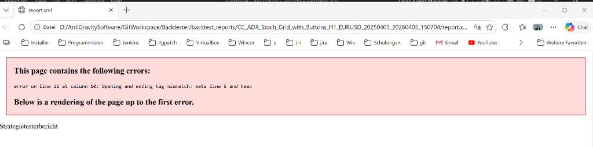

<div align="center">
  <h1>MT5 Backtester 📈</h1>
  <p><strong>A Full-Fledged Automated Execution and Analysis Platform for MetaTrader 5</strong></p>
</div>


## 📌 Overview

**MT5 Backtester** is a powerful Java-based desktop application designed to orchestrate, execute, and analyze automated backtests for MetaTrader 5 Expert Advisors (EAs). 

Built to bypass the tedious manual limitations of the standard MT5 Strategy Tester, this tool enables algorithmic traders to run massive batches of permutations (EAs × Symbols × Timeframes) automatically in the background. It dynamically generates beautiful, entirely offline HTML summary reports with perfectly anti-aliased Java2D equity charts for every single run.

---

## ✨ Core Features

### 1. 🔁 Multi-Backtesting (Batch Execution)
Say goodbye to clicking "Start" 50 times.
- **Cartesian Configuration**: Define arbitrary lists of Expert Advisors, Currency Pairs, and Timeframes.
- **Sequential Execution Engine**: Safely runs MT5 in the background iteratively, guaranteeing no concurrency lockups or resource exhaustion.
- **Fault Tolerance**: If a specific EA or chart configuration fails to load, the engine seamlessly logs the error and proceeds to the next run without halting the batch.


### 2. 📊 High-Performance Offline Reporting
The platform totally divorces itself from MT5's unreliable internal image generator.
- **Native Data Parsing**: Dynamically parses the underlying `report.xml` files generated by the EA, securely extracting metrics and the full tick-by-tick equity history.
- **Java2D Rendering Engine**: Plots crystal-clear, gradient-filled equity curves utilizing custom `Graphics2D` logic completely offline.
- **Aggregated HTML Summary**: Compiles the results of an entire batch run into a single, dense, portable `multi_report.html` file. Base64-embedded charts ensure you can share a single 2MB file over email that looks exactly the same everywhere.



### 3. ⬇️ Integrated Dukascopy Data Downloader
Clean, high-quality data is the soul of a backtest.
- Direct integration with Dukascopy servers to download tick-precision data (Bid/Ask).
- Supports precise timeframe batching and conversion for offline MT5 import testing.

---

## 🛠️ Technology Stack

This application is built with longevity, performance, and cross-platform compatibility in mind:

- **Language**: Java 17 (Compatible up to Java 21)
- **Build System**: Maven (`pom.xml` configured with Shade plugin for single-JAR distribution)
- **GUI Framework**: Java Swing
- **Look & Feel**: [FlatLaf](https://www.formdev.com/flatlaf/) Dark Mode (Customized with deep grey/orange accent palettes for reduced eye-strain during intense data evaluation)
- **Data Parsing**: Fully bespoke HTML/XML parsing logic tuned specifically for localized (e.g. German/English) MetaQuotes report structures.
- **Graphics**: `java.awt.Graphics2D` with anti-aliasing, linear gradients, and responsive text sizing for offline Equity generation.

---

## 🚀 Quickstart

### Prerequisites
1. **Java JDK 17+** installed and available in your environment path.
2. **MetaTrader 5** installed locally (The path is automatically resolved or defined in Settings).

### Build & Run
To run the application locally or build the executable:

```bash
# Clone the repository
git clone https://github.com/tnickel/MT5-Backtester.git
cd MT5-Backtester

# Build the shaded Uber JAR (skipping tests)
mvn clean package -DskipTests

# Start the Application
java -jar target/mt5-backtester-1.0.0.jar
```

## 📁 Repository Structure
- `src/main/java/com/backtester/ui` - Contains all Swing components, tabs, panels, and the custom Chart Renderer.
- `src/main/java/com/backtester/engine` - Execution controllers, `MultiBacktestRunner` tasks, and INI configuration generators.
- `src/main/java/com/backtester/report` - The core logic that parses MT5 history logs and weaves them into our HTML reporting standard.
- `src/main/java/com/backtester/dukascopy` - Logic handling the HTTP tick retrieval from external servers.

---
*Created intentionally without frameworks like Spring to keep the desktop footprint exceptionally small and boot times under 1 second.*
