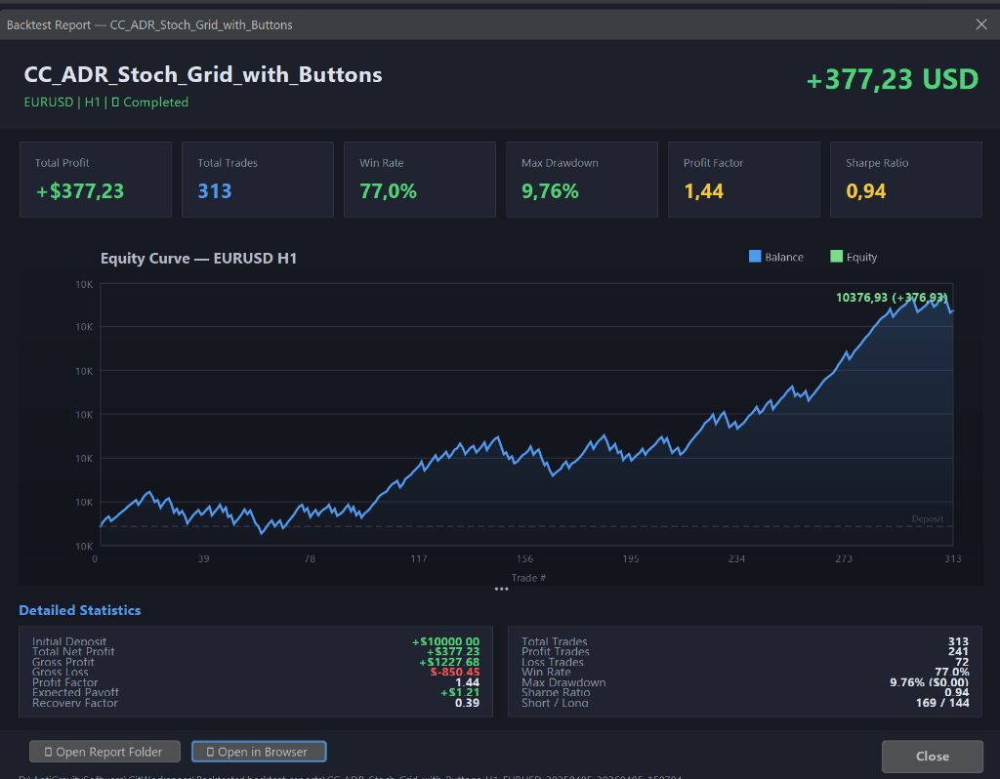
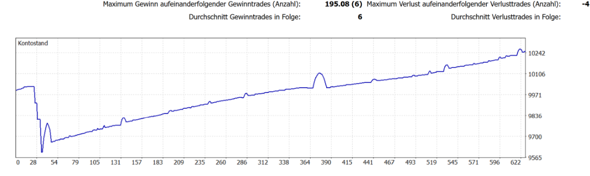

<div align="center">
  <h1>MT5 Backtester 📈</h1>
  <p><strong>A Full-Fledged Automated Execution, Optimization & Robustness Analysis Platform for MetaTrader 5</strong></p>
  <p>
    
    
    
    
    
  </p>
</div>

---



## 📌 Overview

**MT5 Backtester** is a powerful Java-based desktop application designed to orchestrate, execute, optimize, and analyze automated backtests for MetaTrader 5 Expert Advisors (EAs). It eliminates the need for hundreds of manual clicks and transforms the backtesting workflow into a fully automated pipeline.

### Why This Tool?

Testing a single EA on a single symbol with a single timeframe in MT5 requires: opening the strategy tester, configuring 10+ fields, clicking "Start", waiting, inspecting results. Now multiply that by 5 EAs × 10 symbols × 3 timeframes = **150 manual test runs**. This application runs all 150 automatically in sequence while you sleep.

But it goes far beyond simple batch testing — it includes a full **Strategy Optimizer**, a unique **Robustness Scanner** for parameter sensitivity analysis, a **Database-backed Configuration Manager**, persistent **Run History**, and beautiful **offline reporting** with interactive charts.

---

## ✨ Features at a Glance

| Module | Description |
|--------|-------------|
| **▶ Single Backtest** | Execute individual backtests with full parameter control and interactive report viewer |
| **🔁 Multi-Backtester** | Sequential batch execution of EA × Symbol × Timeframe combinations |
| **🔬 Strategy Optimizer** | Genetic & Complete algorithm optimization with forward testing support |
| **📉 Robustness Scanner** | Parameter sensitivity sweep with time-shifted validation & plateau detection |
| **📚 Run History** | Persistent SQLite-backed history browser across all run types |
| **⬇ Dukascopy Data** | Direct tick-data downloads from Dukascopy for independent offline testing |
| **⚙ EA Config Manager** | Full `.set` file lifecycle with DB-backed parameter snapshot storage |

---

## 🔁 Sequential Multi-Backtesting

The core feature that started it all — **eliminate manual work**.

- **Save Hundreds of Clicks**: Define arbitrary lists of Expert Advisors, Currency Pairs, and Timeframes. The platform figures out every combination and runs them automatically in sequence.
- **Strictly Sequential Engine**: Safely runs MT5 in the background one test after another, guaranteeing no concurrency lockups, chart overlaps, or CPU exhaustion.
- **Fault Tolerance**: If a specific EA or chart configuration fails, the engine logs the error and proceeds to the next run.
- **Aggregated HTML Report**: Compiles all batch results into a single `multi_report.html` with Base64-embedded equity charts for easy sharing.



---

## 🔬 Strategy Optimizer

Full integration with MT5's built-in optimization engine, controlled entirely through the Backtester GUI.

- **Optimization Modes**: Disabled, Slow Complete Algorithm, Fast Genetic Algorithm, All Symbols
- **Optimization Criteria**: Balance, Balance + Max PF, Balance + Max Expected Payoff, Balance + Min DD, Balance + Max Recovery Factor, Balance + Max Sharpe Ratio
- **Forward Testing**: No / ½ / ⅓ / ¼ period auto-split, or custom forward date
- **Agent Configuration**: Local, Remote, and MQL5 Cloud agent selection
- **Parameter Table**: Edit optimization ranges (Start/Step/End) directly in a spreadsheet-style table
- **AutoConfig**: Automatically generates reasonable optimization ranges based on heuristic analysis of current parameter values — one click instead of manual math
- **Double-Click to Verify**: Double-click any optimization pass to instantly run a single backtest with those exact parameters and see the full report
- **Apply Best Parameters**: One click to write the best result's parameters back to the EA's active config

---

## 📉 Robustness Scanner (Unique Feature)

A specialized module for advanced strategy validation that goes beyond standard optimization:

**How it works:**
1. Each selected parameter is swept individually via the Complete Algorithm while all other parameters stay fixed
2. Each sweep is repeated across multiple time-shifted periods (e.g., same 1-year window shifted by 90 days × 5 times)
3. An interactive HTML report visualizes parameter sensitivity and highlights stable "plateau" zones

**Key capabilities:**
- **Plateau Detection**: Green zones on charts mark parameter ranges where performance varies < 5% — the sweet spot for robust parameter selection
- **Multi-Period Overlay**: See how parameter sensitivity changes across different market regimes  
- **Live Status Feedback**: Active parameter highlighted in blue, completed ones colored by result quality
- **ETA Estimation**: Real-time remaining time estimate based on elapsed scan performance
- **Remove Failed**: One-click deselect failed or insensitive parameters
- **Database Integration**: Save and load sweep configurations from the DB

---

## 📊 Reporting Engine

The platform completely bypasses MT5's internal report generator and builds its own reports from raw data.

- **HTML Report Parser**: Handles MT5's UTF-16LE encoded reports with German/English locale detection
- **Java2D Equity Charts**: Crystal-clear, anti-aliased equity curves with gradient fills, dual Balance/Equity lines, date-based X-axis, and deposit reference lines
- **Report Viewer Dialog**: Dark-mode modal with 6 metric cards, embedded chart, and 14-field statistics panel
- **Robustness Chart.js Reports**: Interactive line charts with plateau annotations and default-value markers

---

## ⚙ EA Configuration Management

Complete lifecycle management for EA input parameters:

- **`.set` File I/O**: Full read/write support for MT5's UTF-16 LE format with BOM detection
- **Generate Default Config**: Auto-starts MT5 briefly to export the EA's compiled parameter list
- **Database Snapshots**: Store multiple named configurations per EA in SQLite for quick switching
- **Visual Merge View**: Section-grouped table with color-coded modification highlights and live filtering

---

## 📚 Persistent Run History

All backtest types are automatically saved to a local SQLite database:

- **Tree Browser**: Grouped by Run Type → Expert → individual timestamped runs
- **Today Highlighting**: Today's runs rendered in bold green for instant identification
- **Double-Click to Re-Open**: Re-open any historical report directly in the browser
- **Details Panel**: Full JSON metrics summary for each run

---

## 🛠️ Technology Stack

| Component | Technology |
|---|---|
| **Language** | Java 17+ (compatible up to Java 21) |
| **Build** | Maven with Shade plugin (single Uber-JAR) |
| **GUI** | Java Swing with [FlatLaf](https://www.formdev.com/flatlaf/) Dark Mode |
| **Charts** | Native `java.awt.Graphics2D` (app) + Chart.js (HTML reports) |
| **Database** | SQLite via `sqlite-jdbc` |
| **JSON** | Gson |
| **Logging** | SLF4J + Logback |
| **Data Parsing** | Jackson XML, Univocity CSV |
| **Compression** | Tukaani XZ/LZMA for Dukascopy BI5 |
| **Installer** | jpackage + WiX Toolset (MSI) |

---

## 🚀 Quickstart

### Prerequisites
1. **Java JDK 17+** installed and available in your environment path.
2. **MetaTrader 5** installed locally (path configurable in Settings tab).

### Build & Run

```bash
# Clone the repository
git clone https://github.com/tnickel/MT5-Backtester.git
cd MT5-Backtester

# Build the shaded Uber JAR (skipping tests)
mvn clean package -DskipTests

# Start the Application
java -jar target/mt5-backtester-1.0.1.jar
```

### Windows Installer

```powershell
# Generate MSI installer (requires JDK 17+ with jpackage and WiX Toolset)
.\build_installer.ps1
```

---

## 📁 Repository Structure

```
MT5-Backtester/
├── src/main/java/com/backtester/
│   ├── Main.java               # Application entry point
│   ├── config/                 # AppConfig, EaParameter, EaParameterManager
│   ├── database/               # DatabaseManager (SQLite), models
│   ├── engine/                 # BacktestRunner, MultiBacktestRunner,
│   │                           # OptimizationRunner, RobustnessRunner
│   ├── report/                 # ReportParser, MultiReportGenerator,
│   │                           # OptimizationReportParser, RobustnessHtmlGenerator
│   ├── mt5/                    # CustomSymbolManager, Mt5DataImporter
│   ├── dukascopy/              # DukascopyDownloader, Bi5Decoder, CsvConverter
│   └── ui/                     # 13 Swing components (panels, dialogs, charts)
├── config/                     # backtester.properties + ea_params/
├── doc/                        # Project documentation & blog articles
├── images/                     # Screenshots for README
├── mql5/                       # MQL5 helper scripts
├── install/                    # Installer resources
└── pom.xml                     # Maven build configuration
```

---

## 🌐 Supported Symbols

EURUSD, GBPUSD, USDJPY, USDCHF, AUDUSD, NZDUSD, USDCAD, EURGBP, EURJPY, GBPJPY, EURCHF, EURAUD, GBPAUD, AUDNZD, AUDCAD — all with correct Dukascopy point multiplier mappings.

---

## 🤖 AI-Assisted Development

This project is a showcase for modern AI-assisted software engineering. Built using an *Antigravity + Gemini Ultra* prompt chain workflow, the application grew from concept to a production-ready desktop application with **8 major modules**, **30+ Java classes**, and **15,000+ lines of code** in a fraction of the traditional development timeline. 

**The human developer remains essential** — for architecture decisions, debugging edge cases (UTF-16 parsing, German locale support), UX refinement, and domain expertise in algorithmic trading. AI accelerated the boilerplate, the human refined the product.

---

## 📄 License

This project is open source. See the repository for details.

## 🔗 Links

- **GitHub**: [https://github.com/tnickel/MT5-Backtester](https://github.com/tnickel/MT5-Backtester)
- **Portfolio**: [https://tnickel-ki.de/](https://tnickel-ki.de/)
